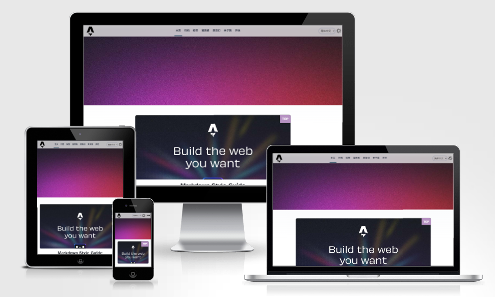

# Astro-Blog-Plus
<div style="display: flex; align-items: center">
    <a href="https://vercel.com/new/clone?repository-url=https%3A%2F%2Fgithub.com%2FTsukistar%2Fastro-blog-plus%2Ftree%2Fmain" target="_blank" rel="noopener noreferrer">
        
    </a>
    <div style="font-weight: bolder; font-size: larger; margin-left: 10px; padding-bottom: 10px;">
        <a href="./README.zh-hans.md" target="_blank" rel="noopener noreferrer">简体中文</a> | 
        <a href="./README.zh-hant.md" target="_blank" rel="noopener noreferrer">正體中文</a>
    </div>
</div>



"Astro-Blog-Plus" is a template built on Astro's official blog template. It comes with several new features and improvements, especially optimized for mobile layouts.

You can fork this repository and deploy your own version to Vercel by clicking the "Deploy" button.

## ⭐Features:

- ✅ All the features of the original "blog" template are included.
- ✅ Mobile layout optimization.
- ✅ Support for Astro's built-in pagination and top up your post.
- ✅ Integration with the [Waline Comment System](https://waline.js.org/).
- ✅ Dark mode and light mode switch.
- ✅ Internationalization (i18n) routing.
- ✅ New pages added, such as Friends, Archives, Tags, Message Board, and more.

## 🚀Project Structure:
The project includes the following folders and files:
```yml
│   astro.config.mjs
│   package.json
│   tsconfig.json
└───src
    │   env.d.ts
    ├───components
    │       BaseHead.astro
    │       BlogPostLicense.astro 
    │       Footer.astro
    │       FormattedDate.astro
    │       Header.astro
    │       HeaderLink.astro
    │       LanguageSelector.astro
    │       MainBlogHead.astro
    │       MobileMenu.astro
    │       SinglePageHead.astro
    │       ThemeIcon.astro
    │       WalineComment.astro 
    ├───content
    │   │   config.ts
    │   ├───draft 
    │   └───{lang}
    ├───layouts
    │       BlogPost.astro
    ├───locales
    │   └───{lang}
    │           friends.json
    │           translation.json
    ├───pages
    │   │   index.astro
    │   ├───{lang}
    │   │   │   about.astro
    │   │   │   archives.astro
    │   │   │   friends.astro
    │   │   │   index.astro
    │   │   │   messageBoard.astro
    │   │   │   tags.astro
    │   │   │   [...slug].astro
    │   │   │   [page].astro
    │   │   └───tags 
    │   │           [tag].astro    
    │   └───rss
    │        └───{lang}.xml.js          
    └───styles
            global.css
            main-blog.css
            single-page.css
```

- Astro looks for `.astro` or `.md` files in the `src/pages/` directory. Each file is exposed as a route based on its file name.

- The `components` folder contains various reusable components. To develop new components, you can add a `.astro` file in this folder and import it wherever needed.

- For i18n, this template supports three languages: zh-hans (Simplified Chinese), zh-hant (Traditional Chinese), and en (English). To add a new language, such as Japanese, you need to create a new folder named "jp" in the `pages`, `content`, and `locales` directories. Additionally, add a `jp.xml.js` file in `src/pages/rss`. Finally, include `translation.json` and `friends.json` in `/src/locales/jp` with the necessary translations.

- The `src/content/` directory contains "collections" of related Markdown and MDX documents. Use `getCollection()` to retrieve posts from `src/content/blog/` and type-check your frontmatter using an optional schema. For more details, see [Astro's Content Collections documentation](https://docs.astro.build/en/guides/content-collections/).

- Any static assets, such as fonts and images, should be placed in the `public/` directory.

## Credit

This theme is based on Astro's official [blog template](https://github.com/withastro/templates/tree/main/templates/blog).Astro's [official documentation](https://docs.astro.build/en/getting-started/) helped me solve many issues during the development process.

---
<a href='https://ko-fi.com/A0A0T96C9' target='_blank'></a>