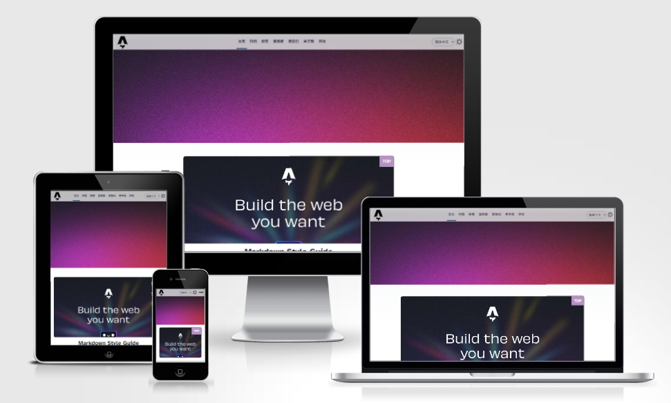

# Astro-Blog-Plus

<div style="display: flex; align-items: center">
    <a href="https://vercel.com/new/clone?repository-url=https%3A%2F%2Fgithub.com%2FTsukistar%2Fastro-blog-plus%2Ftree%2Fmain" target="_blank" rel="noopener noreferrer">
        
    </a>
</div>



“Astro-Blog-Plus”是基於Astro官方[部落格模板](https://github.com/withastro/templates/tree/main/templates/blog)構建的模板。它增加了許多新功能，並對移動端佈局進行了最佳化。

您可以透過點選“Deploy”按鈕，fork此倉庫並將其部署到Vercel。

## ⭐ 特色功能:

- ✅ 包含原始“部落格”模板的所有功能。
- ✅ 移動端佈局最佳化。
- ✅ 支援Astro內建分頁與文章置頂。
- ✅ 整合[Waline評論系統](https://waline.js.org/)。
- ✅ 支援黑暗模式。
- ✅ 國際化（i18n）路由支援。
- ✅ 新增了許多新頁面，例如：友鏈、歸檔、標籤、留言板等。

## 🚀 專案結構:

該模板包含以下資料夾和檔案：

```yml
│   astro.config.mjs
│   package.json
│   tsconfig.json
└───src
    │   env.d.ts
    ├───components
    │       BaseHead.astro
    │       BlogPostLicense.astro 
    │       Footer.astro
    │       FormattedDate.astro
    │       Header.astro
    │       HeaderLink.astro
    │       LanguageSelector.astro
    │       MainBlogHead.astro
    │       MobileMenu.astro
    │       SinglePageHead.astro
    │       ThemeIcon.astro
    │       WalineComment.astro 
    ├───content
    │   │   config.ts
    │   ├───draft 
    │   └───{lang}
    ├───layouts
    │       BlogPost.astro
    ├───locales
    │   └───{lang}
    │           friends.json
    │           translation.json
    ├───pages
    │   │   index.astro
    │   ├───{lang}
    │   │   │   about.astro
    │   │   │   archives.astro
    │   │   │   friends.astro
    │   │   │   index.astro
    │   │   │   messageBoard.astro
    │   │   │   tags.astro
    │   │   │   [...slug].astro
    │   │   │   [page].astro
    │   │   └───tags 
    │   │           [tag].astro    
    │   └───rss
    │        └───{lang}.xml.js          
    └───styles
            global.css
            main-blog.css
            single-page.css
```

- Astro會在`src/pages/`目錄中查詢`.astro`或`.md`檔案。每個檔案根據其檔名生成一個路由。

- `components`資料夾包含了許多複用率高的元件。要開發新的元件，您可以在此資料夾中新增`.astro`檔案，並在需要的地方匯入它。

- 對於國際化，此模板預設支援三種語言：zh-hans（簡體中文）、zh-hant（繁體中文）和en（英語）。要新增新的語言，例如日語，您需要在`pages`、`content`和`locales`目錄中建立一個名為"jp"的新資料夾。此外，在`src/pages/rss`中新增一個`jp.xml.js`檔案。最後，在`/src/locales/jp`中新增`translation.json`和`friends.json`，並新增您的內容翻譯。

- `src/content/`目錄包含相關的Markdown和MDX文件的“集合”。Astro使用`getCollection()`從`src/content/blog/`中檢索文章，並使用可選的模式進行前置資料的型別檢查。有關更多詳細資訊，請參閱[Astro的內容集合文件](https://docs.astro.build/en/guides/content-collections/)。

- 任何靜態資源，如字型和影象，應該放置在`public/`目錄中。

## 致謝

此主題基於Astro的官方[部落格模板](https://github.com/withastro/templates/tree/main/templates/blog)。在開發過程中，Astro的[官方文件](https://docs.astro.build/zh-cn/getting-started/)幫助我解決了許多問題。

---

<a href='https://ko-fi.com/A0A0T96C9' target='_blank'></a>